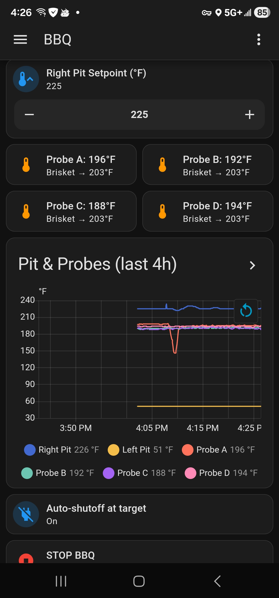

# RecTeq for Home Assistant

Local-only Home Assistant integration for RecTeq Wi-Fi grills (DualFire 2000, with more models to come).

After a one-time login with your RecTeq app credentials, this integration talks to the grill **directly over your local network** — no cloud round-trips, sub-second response, and it keeps working when your internet goes down.

  

## What you get

For the DualFire 2000:

- **Switches** — Left and Right burners
- **Numbers** — Setpoints (180–700 °F), min feed rate, temperature calibration
- **Sensors** — Pit temps (left/right), four meat probes (A–D)
- **Binary sensors** — Three error flags per side (problem device class — show red on dashboards)

All grouped under one device in HA's device registry, native °F (so HA's metric locale doesn't auto-convert your cook temps to °C).

## Install

### Via HACS (recommended)

1. HACS → ⋮ → **Custom repositories** → add `https://github.com/macsux/homeassistant-recteq`, type **Integration**.
2. Search **RecTeq** → Download.
3. Restart Home Assistant.
4. **Settings → Devices & Services → Add Integration → RecTeq**.
5. Enter your RecTeq app email + password. Done.

### Manual

Copy `custom_components/recteq/` into your HA config dir's `custom_components/`, restart, then add the integration from the UI.

## How the auth works (short version)

The integration logs in to RecTeq's branded Tuya OEM API (`a1.tuyaus.com`) with your credentials, then calls `tuya.m.location.list` to enumerate your homes and `tuya.m.my.group.device.list` (with `gid` as a URL param) to enumerate the devices in each home — that's where each grill's `localKey` comes from. From that point on, all communication is direct over your LAN using Tuya's 3.4 protocol. The cloud is only contacted again if the localKey rotates (rare; the integration auto-detects and silently refreshes).

The OEM API client ID, app secret, and signing keys are constants extracted from the official RecTeq Android app — they are app-level identifiers, not user secrets, and are baked into this integration so the user only ever needs their own account credentials.

After cloud listing, we still UDP-scan the local network to discover the grill's current LAN IP. This works on Linux / HAOS / Pi installs out of the box. On Docker Desktop for macOS or Windows the bridge network swallows broadcasts, so a manual IP entry step appears as a fallback.

## Supported devices

| Model | Product ID | Status |
|---|---|---|
| DualFire 2000 | `q5utybemjsoh72nx` | ✅ |
| Bullseye, RT-700, RT-1250, etc. | — | Open an issue with your `productId` from `Settings → Devices & Services → RecTeq → Diagnostic` |

Adding a new model is a small PR — append a DP map to `const.PRODUCT_DP_MAPS`. Issues with diagnostic dumps welcome.

## Local-only requirements

- Grill on the same LAN as Home Assistant (no VLAN isolation between them)
- Outbound HTTPS to `a1.tuyaus.com` from HA, **only** at config time and for occasional key refresh — runtime is 100% local
- UDP discovery on ports 6666–6667 from the grill (it broadcasts every few seconds; the integration auto-detects the IP)

## License

MIT — see [LICENSE](LICENSE).

## Acknowledgments

- [tinytuya](https://github.com/jasonacox/tinytuya) — local Tuya protocol library this integration builds on.
- The RecTeq community on r/RecTeq for confirmation of DP semantics across models.
